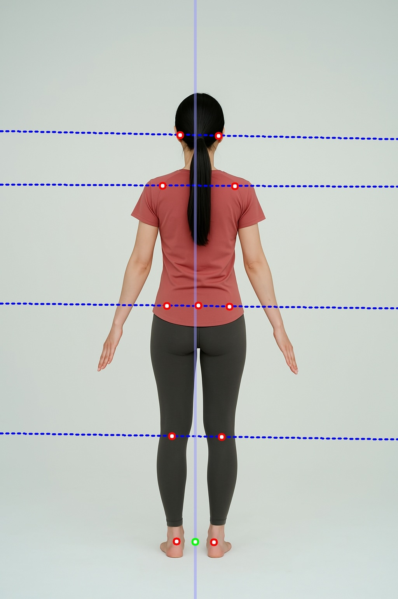

# 후면 이미지 골격 분석 요청

※ 전면, 후면, 측면1, 측면2 이미지 분리요청 방식

※ 전면, 측면1 요청시, 1 credit 소비


※ 전면, 후면, 측면1, 측면2 요청시, 2 credit 소비

### 후면 이미지 골격 분석 요청

<mark style="color:green;">`POST`</mark> `http://api.remo.re.kr/api/analysis-skeleton-v2-back`

후면 사진을 입력 받아 신체 골격을 분석합니다.

**파라미터(json)**

<table><thead><tr><th>Name</th><th>Type</th><th>Description</th><th data-type="checkbox">Required</th></tr></thead><tbody><tr><td><code>Email</code></td><td>string</td><td>유저 이메일 주소</td><td>true</td></tr><tr><td><code>UserKey</code></td><td>string</td><td>발급 받은 유저 키 값</td><td>true</td></tr><tr><td><code>APIKey</code></td><td>string</td><td>발급 받은 API 키 값</td><td>true</td></tr><tr><td><code>borigimg</code></td><td>string(base64)</td><td>base64로 인코딩 된 후면 사진</td><td>true</td></tr></tbody></table>

**응답(json)**

\*왼쪽 오른쪽 기준은 사진의 피사체 기준

<table><thead><tr><th width="282">Name</th><th width="94">Type</th><th>Description</th></tr></thead><tbody><tr><td><code>state</code></td><td>bool</td><td>성공 시 True, 실패 시 False</td></tr><tr><td><code>status_code</code></td><td>int</td><td>성공 시 200, 실패 시 에러 코드값 전달</td></tr><tr><td><code>uuid</code></td><td>string</td><td>파라미터로 전달 받은 uuid</td></tr><tr><td><code>credit_change</code></td><td>int</td><td>분석에서 사용된 크레딧 수량</td></tr><tr><td><code>credit</code></td><td>int</td><td>현재 소지한 크레딧</td></tr><tr><td><code>forigimg</code></td><td>string</td><td>정면 사진에 결과를 그려 base64로 인코딩된 이미지</td></tr><tr><td><code>sorigimg</code></td><td>string</td><td>측면 사진에 결과를 그려 base64로 인코딩된 이미지</td></tr><tr><td><code>borigimg</code></td><td>string</td><td>후면 사진에 결과를 그려 base64로 인코딩된 이미지</td></tr><tr><td><code>bar_coords</code></td><td>string</td><td>json 문자열로 변환된 후면 2차원 골격 좌표</td></tr><tr><td><code>bar_head_bal_m_</code></td><td>float</td><td>머리 균형도(머리 기울기). degree 단위.</td></tr><tr><td><code>bar_head_bal_grade</code></td><td>int</td><td><p>머리 균형도(머리 기울기).</p><p>-2 : 오른쪽 위로 기울어짐 위험(value&#x3C;=-5)</p><p>-1 : 오른쪽 위로 기울어짐 주의(-5&#x3C;value&#x3C;=-1.5)</p><p>0 : 정상(-1.5&#x3C;value&#x3C;1.5)</p><p>1 : 왼쪽 위로 기울어짐 주의(1.5&#x3C;=value&#x3C;5)</p><p>2 : 왼쪽 위로 기울어짐 위험(value>=5)</p></td></tr><tr><td><code>bar_pelvic_bal_m_</code></td><td>float</td><td>골반 균형도(골반 기울기). degree 단위.</td></tr><tr><td><code>bar_pelvic_bal_grade</code></td><td>int</td><td><p>골반 균형도(골반 기울기).<br>-2 : 오른쪽 위로 기울어짐 위험(value&#x3C;=-5)</p><p>-1 : 오른쪽 위로 기울어짐 주의(-5&#x3C;value&#x3C;=-1.5)</p><p>0 : 정상(-1.5&#x3C;value&#x3C;1.5)</p><p>1 : 왼쪽 위로 기울어짐 주의(1.5&#x3C;=value&#x3C;5)</p><p>2 : 왼쪽 위로 기울어짐 위험(value>=5)</p></td></tr><tr><td><code>bar_shoulder_bal_m_</code></td><td>float</td><td>어깨 균형도(어깨 기울기). degree 단위.</td></tr><tr><td><code>bar_shoulder_bal_grade</code></td><td>int</td><td><p>어깨 균형도(어깨 기울기).<br>-2 : 오른쪽 위로 기울어짐 위험(value&#x3C;=-5)</p><p>-1 : 오른쪽 위로 기울어짐 주의(-5&#x3C;value&#x3C;=-1.5)</p><p>0 : 정상(-1.5&#x3C;value&#x3C;1.5)</p><p>1 : 왼쪽 위로 기울어짐 주의(1.5&#x3C;=value&#x3C;5)</p><p>2 : 왼쪽 위로 기울어짐 위험(value>=5)</p></td></tr><tr><td><code>bar_left_qang_m_</code></td><td>float</td><td>왼쪽 오다리 값. degree 단위.</td></tr><tr><td><code>bar_left_qang_grade</code></td><td>int</td><td><p>왼쪽 오다리 값 평가.<br>-2 : X다리 위험(value&#x3C;=-10)</p><p>-1 : X다리 주의(-10&#x3C;value&#x3C;=-5)</p><p>0 : 정상(-5&#x3C;value&#x3C;5)</p><p>1 : O다리 주의(5&#x3C;=value&#x3C;10)</p><p>2 : O다리 위험(value>=10)</p></td></tr><tr><td><code>bar_right_qang_m_</code></td><td>float</td><td>오른쪽 오다리 값. degree 단위.</td></tr><tr><td><code>bar_right_qang_grade</code></td><td>int</td><td><p>오른쪽 오다리 값 평가.<br>-2 : X다리 위험(value&#x3C;=-10)</p><p>-1 : X다리 주의(-10&#x3C;value&#x3C;=-5)</p><p>0 : 정상(-5&#x3C;value&#x3C;5)</p><p>1 : O다리 주의(5&#x3C;=value&#x3C;10)</p><p>2 : O다리 위험(value>=10)</p></td></tr><tr><td><code>bar_knee_bal_m_</code></td><td>float</td><td>무릎 균형도(무릎 기울기). degree 단위.</td></tr><tr><td><code>bar_knee_bal_grade</code></td><td>int</td><td><p>무릎 균형도(무릎 기울기) 평가.<br>-2 : 오른쪽 위로 기울어짐 위험(value&#x3C;=-5)</p><p>-1 : 오른쪽 위로 기울어짐 주의(-5&#x3C;value&#x3C;=-1.5)</p><p>0 : 정상(-1.5&#x3C;value&#x3C;1.5)</p><p>1 : 왼쪽 위로 기울어짐 주의(1.5&#x3C;=value&#x3C;5)</p><p>2 : 왼쪽 위로 기울어짐 위험(value>=5)</p></td></tr><tr><td><code>bar_tilt_m_</code></td><td>float</td><td>후면 축 기울기(좌우 기울기). degree 단위.</td></tr><tr><td><code>bar_tilt_grade</code></td><td>int</td><td><p>후면 축 기울기(좌우 기울기) 평가.<br>-2 : 오른쪽 위로 기울어짐 위험(value&#x3C;=-5)</p><p>-1 : 오른쪽 위로 기울어짐 주의(-5&#x3C;value&#x3C;=-1.5)</p><p>0 : 정상(-1.5&#x3C;value&#x3C;1.5)</p><p>1 : 왼쪽 위로 기울어짐 주의(1.5&#x3C;=value&#x3C;5)</p><p>2 : 왼쪽 위로 기울어짐 위험(value>=5)</p></td></tr></tbody></table>

**요청 예시**

```json
{
  "Email": “example@email.com”,
  "UserKey": “userkey”,
  "APIKey": “apikey”,
  "borigimg": "/9j/4AAQSkZJRgABAQAAAQABAAD/2wBDAAIBAQEBAQIBAQECAgICAgQDAgICAgUEBAMEBgUGBgYFBgYGBw ... (생략)(이미지를 바이트로 변환한 결과)"
 }
```

**예시 코드**



```bash
curl -X POST "http://api.remo.re.kr/api/analysis-skeleton-v2-back" \
-H "Content-Type: application/json" \
-d '{
    "Email": "your_email",
    "UserKey": "your_user_key",
    "APIKey": "your_api_key",
    "borigimg": "'$(base64 -w 0 path/to/your/back/image)'"
}'
```



```python
import requests
import uuid
import base64

bimg_path = "path/to/your/back/image"

with open(bimg_path, "rb") as img_file:
    bimg_b64 = base64.b64encode(img_file.read()).decode('utf-8')

task_uuid = str(uuid.uuid4())
rq_dict = {'Email': "your_email", "UserKey": "your_user_key", "APIKey": "your_api_key", "borigimg": bimg_b64}

res = requests.post("http://api.remo.re.kr/api/analysis-skeleton-v2-back", json=rq_dict)
```



```javascript
import fetch from 'node-fetch';
import fs from 'fs';
cv2.imshow('front_img', front_img)
cv2.imshow('side_img', side_img)
import { v4 as uuidv4 } from 'uuid';

const bimg_path = "path/to/your/back/image";

const bimg_b64 = fs.readFileSync(bimg_path, { encoding: 'base64' });

const task_uuid = uuidv4();
const rq_dict = {
  Email: "your_email",
  UserKey: "your_user_key",
  APIKey: "your_api_key",
  borigimg: bimg_b64,
};

fetch("http://api.remo.re.kr/api/analysis-skeleton-v2-back", {
  method: 'POST',
  headers: {
    'Content-Type': 'application/json'
  },
  body: JSON.stringify(rq_dict)
})
.then(response => response.json())
.then(data => console.log(data))
.catch(error => console.error('Error:', error));

```



**응답 예시**



```json
{
  'state': True,
  'status_code': 200,
  'APIName': 'Analysis-skeleton-v2',
  'credit_change': -1,
  'credit': 99984228,
  'uuid': '59e9a3a1-a8d2-42a1-b2af-3a87cd01f682',
  'borigimg': 'data:image/jpeg;base64,/9j/4A ... (중략) ... A8x//2Q==',
  'bar_coords': '[[1060, 816], [1053, 1079], [1199, 1134], [1417, 1340], [1609, 1465], [903, 1121], [661, 1301], [448, 1397], [1162, 1605], [1156, 2076], [1159, 2449], [899, 1595], [873, 2069], [861, 2438], [1028, 1586], [1042, 1358], [1054, 991], [983, 943], [1007, 937], [1034, 979], [1128, 950], [1075, 940]]',
  'bar_head_bal_grade': 0,
  'bar_head_bal_m_': -0.011,
  'bar_knee_bal_grade': 0,
  'bar_knee_bal_m_': -0.312,
  'bar_left_qang_grade': 0,
  'bar_left_qang_m_': 0.665,
  'bar_pelvic_bal_grade': 0,
  'bar_pelvic_bal_m_': 0.299,
  'bar_right_qang_grade': 0,
  'bar_right_qang_m_': 2.109,
  'bar_shoulder_bal_grade': 0,
  'bar_shoulder_bal_m_': 0.544,
  'bar_tilt_grade': 0,
  'bar_tilt_m_': -0.125
}
```



```json
{
  "state": False,
  "credit": 100,
  "message": 'error from back image decoding b64',
  "status":413
}
```



```json
{
  "state": False,
  "credit": 100,
  "message": 'In the back image, the model is not facing side ',
  "status": 515
}
```



**에러 코드 안내**

| 대분류          | 소분류            | 코드  |
| ------------ | -------------- | --- |
| 입력 데이터 문제 발생 | 프로토콜 에러        | 400 |
|              | 입력 데이터 없음      | 411 |
|              | 첨부 이미지 에러      | 412 |
| 기타 이슈 발생     | 사용 유저 확인 안됨    | 420 |
|              | APIKey 틀림      | 421 |
|              | 크리딧 부족         | 422 |
| 분석 이슈 발생     | 후면 사진 사람 인식 안됨 | 518 |
|              | 후면 사진의 각도 틀림   | 522 |
| 프로세스 에러      | 프로세스 처리 에러     | 550 |
|              | 프로세스 처리 기타 에러  | 559 |

**요청 이미지 결과 보기**



```python
import requests
import uuid
import base64
import cv2
import numpy as np
import uuid

bimg_path = "path/to/your/back/image"

with open(bimg_path, "rb") as img_file:
    bimg_b64 = base64.b64encode(img_file.read()).decode('utf-8')

task_uuid = str(uuid.uuid4())
rq_dict = {'Email': "your_email", "UserKey": "your_user_key", "APIKey": "your_api_key", 'uuid': task_uuid, "borigimg": bimg_b64}
res = requests.post("http://api.remo.re.kr/api/analysis-skeleton", json=rq_dict).json()

# 후면 이미지 분석 결과 데이터를 byte데이터에서 array 데이터로 변환
bimg_b64 = res["borigimg"] #측면 이미지 분석 결과 데이터
b_bytes = base64.b64decode(split_b64_video(bimg_b64).encode('utf-8'))
back_nparr = np.frombuffer(b_bytes, np.uint8)
back_img = cv2.imdecode(back_nparr, cv2.IMREAD_COLOR)

# Display the image using OpenCV
cv2.imshow('back_img', back_img)
cv2.waitKey(0)
cv2.destroyAllWindows()
```



**결과 이미지**

<figure><figcaption><p>borigimg</p></figcaption></figure>
