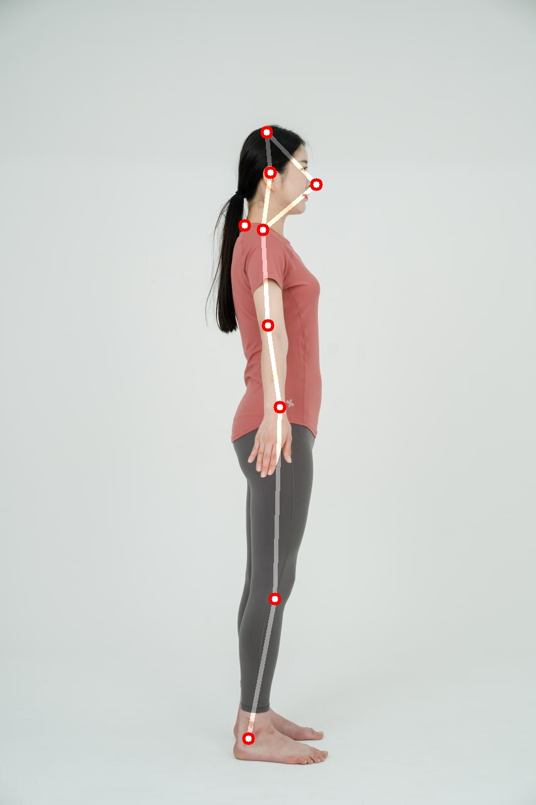

# 측면 이미지 골격 분석 요청

※ 전면, 후면, 측면1, 측면2 이미지 분리요청 방식

※ 전면, 측면1 요청시, 1 credit 소비

※ 전면, 후면, 측면1, 측면2 요청시, 2 credit 소비

### 측면 이미지 골격 분석 요청

<mark style="color:green;">`POST`</mark> `http://api.remo.re.kr/api/analysis-skeleton-v2-side`

측면 사진을 입력 받아 신체 골격을 분석합니다.

**파라미터(json)**

<table><thead><tr><th>Name</th><th>Type</th><th>Description</th><th data-type="checkbox">Required</th></tr></thead><tbody><tr><td><code>Email</code></td><td>string</td><td>유저 이메일 주소</td><td>true</td></tr><tr><td><code>UserKey</code></td><td>string</td><td>발급 받은 유저 키 값</td><td>true</td></tr><tr><td><code>APIKey</code></td><td>string</td><td>발급 받은 API 키 값</td><td>true</td></tr><tr><td><code>sorigimg</code></td><td>string(base64)</td><td>base64로 인코딩 된 측면 사진</td><td>true</td></tr></tbody></table>

**응답(json)**

\*왼쪽 오른쪽 기준은 사진의 피사체 기준

<table><thead><tr><th width="282">Name</th><th width="94">Type</th><th>Description</th></tr></thead><tbody><tr><td><code>state</code></td><td>bool</td><td>성공 시 True, 실패 시 False</td></tr><tr><td><code>status_code</code></td><td>int</td><td>성공 시 200, 실패 시 에러 코드값 전달</td></tr><tr><td><code>uuid</code></td><td>string</td><td>파라미터로 전달 받은 uuid</td></tr><tr><td><code>credit_change</code></td><td>int</td><td>분석에서 사용된 크레딧 수량</td></tr><tr><td><code>credit</code></td><td>int</td><td>현재 소지한 크레딧</td></tr><tr><td><code>sorigimg</code></td><td>string</td><td>측면 사진에 결과를 그려 base64로 인코딩된 이미지</td></tr><tr><td><code>round_shoulder_m_</code></td><td>float</td><td>굽은 어께 기울기. degree 단위.</td></tr><tr><td><code>round_shoulder_grade</code></td><td>int</td><td>굽은 어께 기울기 평가.<br>0 : 정상(value&#x3C;5)<br>1 : 주의(5&#x3C;=value&#x3C;15)<br>2 : 위험(value>=15)</td></tr><tr><td><code>sar_coords</code></td><td>string</td><td>json 문자열로 변환된 측면 2차원 골격좌표</td></tr><tr><td><code>sar_head_tilt_grade</code></td><td>int</td><td><p>측면 머리 균형도(측면 머리 기울기) 평가.<br>-2 : 뒤로 기울어짐 위험(value&#x3C;=-5)</p><p>-1 : 뒤로 기울어짐 주의(-5&#x3C;value&#x3C;=-1.5)</p><p>0 : 정상(-1.5&#x3C;value&#x3C;1.5)</p><p>1 : 앞으로 기울어짐 주의(1.5&#x3C;=value&#x3C;5)</p><p>2 : 앞으로 기울어짐 위험(value>=5)</p></td></tr><tr><td><code>sar_head_tilt_m_</code></td><td>float</td><td>측면 머리 균형도(머리 앞뒤 기울기). degree 단위.</td></tr><tr><td><code>sar_tilt_m_</code></td><td>float</td><td>측면 기울기(전신 앞뒤 기울기). degree 단위.</td></tr><tr><td><code>sar_tilt_grade</code></td><td>int</td><td><p>측면 기울기(전신 앞뒤 기울기) 평가.<br>-2 : 뒤로 기울어짐 위험(value&#x3C;=-5)</p><p>-1 : 뒤로 기울어짐 주의(-5&#x3C;value&#x3C;=-1.5)</p><p>0 : 정상(-1.5&#x3C;value&#x3C;3)</p><p>1 : 앞으로 기울어짐 주의(3&#x3C;=value&#x3C;10)</p><p>2 : 앞으로 기울어짐 위험(value>=10)</p></td></tr><tr><td><code>turtle_neck_m_</code></td><td>float</td><td>거북목 기울기. degree 단위.</td></tr><tr><td><code>turtle_neck_grade</code></td><td>int</td><td>거북목 기울기 평가.<br>0 : 정상(value&#x3C;=30)<br>1 : 주의(30&#x3C;value&#x3C;40)<br>2 : 위험(value>=40)</td></tr></tbody></table>

**요청 예시**

```json
{
  "Email": “example@email.com”,
  "UserKey": “userkey”,
  "APIKey": “apikey”,
  "sorigimg": "/9j/4AAQSkZJRgABAQAAAQABAAD/2wBDAAIBAQEBAQIBAQECAgICAgQDAgICAgUEBAMEBgUGBgYFBgYGBw ... (생략)(이미지를 바이트로 변환한 결과)"
 }
```

**예시 코드**



```bash
curl -X POST "http://api.remo.re.kr/api/analysis-skeleton-v2-side" \
-H "Content-Type: application/json" \
-d '{
    "Email": "your_email",
    "UserKey": "your_user_key",
    "APIKey": "your_api_key",
    "sorigimg": "'$(base64 -w 0 path/to/your/side/image)'"
}'
```



```python
import requests
import uuid
import base64

simg_path = "path/to/your/side/image"

with open(simg_path, "rb") as img_file:
    simg_b64 = base64.b64encode(img_file.read()).decode('utf-8')

task_uuid = str(uuid.uuid4())
rq_dict = {'Email': "your_email", "UserKey": "your_user_key", "APIKey": "your_api_key", "sorigimg": simg_b64}

res = requests.post("http://api.remo.re.kr/api/analysis-skeleton-v2-side", json=rq_dict)
```



```javascript
import fetch from 'node-fetch';
import fs from 'fs';
import { v4 as uuidv4 } from 'uuid';

const simg_path = "path/to/your/side/image";

const simg_b64 = fs.readFileSync(simg_path, { encoding: 'base64' });

const task_uuid = uuidv4();
const rq_dict = {
  Email: "your_email",
  UserKey: "your_user_key",
  APIKey: "your_api_key",
  sorigimg: simg_b64,
};

fetch("http://api.remo.re.kr/api/analysis-skeleton-v2-side", {
  method: 'POST',
  headers: {
    'Content-Type': 'application/json'
  },
  body: JSON.stringify(rq_dict)
})
.then(response => response.json())
.then(data => console.log(data))
.catch(error => console.error('Error:', error));

```



**응답 예시**



```json
{
  'state': True,
  'status_code': 200,
  'APIName': 'Analysis-skeleton-v2',
  'credit_change': -1,
  'credit': 99984228,
  'uuid': '59e9a3a1-a8d2-42a1-b2af-3a87cd01f682',
  'sorigimg': 'data:image/jpeg;base64,/9j/4A ... (중략) ... A8x//2Q==',
  'round_shoulder_grade': 0,
  'round_shoulder_m_': 2.698,
  'sar_coords': '[[424, 210], [418, 365], [419, 382], [435, 527], [437, 659], [423, 406], [434, 550], [448, 649], [435, 651], [437, 952], [395, 1174], [439, 650], [431, 931], [398, 1143], [445, 647], [425, 517], [426, 314], [433, 293], [485, 275], [503, 293], [430, 274], [484, 266]]',
  'sar_head_tilt_grade': -1,
  'sar_head_tilt_m_': -2.227,
  'sar_tilt_grade': 2,
  'sar_tilt_m_': 6.37,
  'turtle_neck_grade': 0,
  'turtle_neck_m_': 29.711
}
```



```json
{
  "state": False,
  "credit": 100,
  "message": 'error from front image decoding b64',
  "status":413
}
```



```json
{
  "state": False,
  "credit": 100,
  "message": 'In the side image, the model is not facing side ',
  "status": 515
}
```



**에러 코드 안내**

| 대분류          | 소분류            | 코드  |
| ------------ | -------------- | --- |
| 입력 데이터 문제 발생 | 프로토콜 에러        | 400 |
|              | 입력 데이터 없음      | 411 |
|              | 첨부 이미지 에러      | 412 |
|              | 첨부 이미지 에러(측면)  | 414 |
| 기타 이슈 발생     | 사용 유저 확인 안됨    | 420 |
|              | APIKey 틀림      | 421 |
|              | 크리딧 부족         | 422 |
| 분석 이슈 발생     | 측면 사진 사람 인식 안됨 | 512 |
|              | 측면 사진의 각도 틀림   | 515 |
| 프로세스 에러      | 프로세스 처리 에러     | 550 |
|              | 프로세스 처리 기타 에러  | 559 |

**요청 이미지 결과 보기**



```python
import requests
import uuid
import base64
import cv2
import numpy as np
import uuid

simg_path = "path/to/your/side/image"

with open(simg_path, "rb") as img_file:
    simg_b64 = base64.b64encode(img_file.read()).decode('utf-8')

task_uuid = str(uuid.uuid4())
rq_dict = {'Email': "your_email", "UserKey": "your_user_key", "APIKey": "your_api_key", 'uuid': task_uuid, "sorigimg": simg_b64}
res = requests.post("http://api.remo.re.kr/api/analysis-skeleton-v2-side", json=rq_dict).json()

simg_b64 = res["sorigimg"]
s_bytes = base64.b64decode(split_b64_video(simg_b64).encode('utf-8'))
side_nparr = np.frombuffer(s_bytes, np.uint8)
side_img = cv2.imdecode(side_nparr, cv2.IMREAD_COLOR)

cv2.imshow('side_img', side_img)
cv2.waitKey(0)
cv2.destroyAllWindows()
```



**결과 이미지**

<figure><figcaption><p>sorigimg</p></figcaption></figure>
